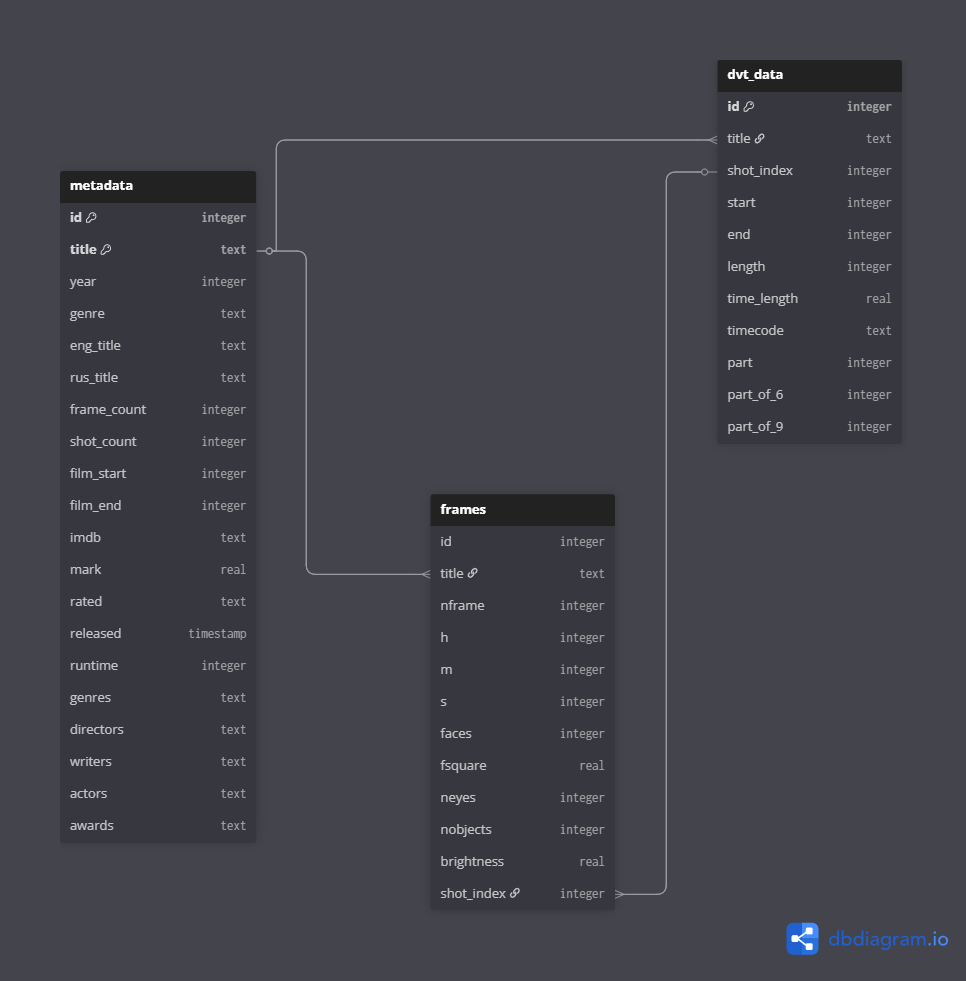

# Hollywood-90s-Data
Данные о голливудских фильмах 1990-х годов, полученные с помощью цифровых инструментов для анализа видео.

Датасет расположен [по ссылке](https://drive.google.com/file/d/1eIWXP_RD2y7FwQU4ZmQTBzDkorJ3OhXS/view?usp=sharing).

Содержание датасета:

1. corst_data.csv &mdash; the dataset
2. tags_glossary.pdf &mdash; errors tags glossary
3. criteria.pdf &mdash; criteria for evaluating automatic corrections
4. rus &mdash; the folder with russian version of tags glossary and criteria

Данные собраны для анализа кинематографических трендов. В датасет вошли 298 фильмов Голливуда 1990-х. Метаданные для фильмов собраны по сайту imdb.com
Датасет доступен в формате db (sql-база данных) и отдельными csv-таблицами.

Схема базы данных:

Список использованных инструментов: 

Вычисленные параметры могут содержать погрешности из-за специфики исходного видео и использованных инструментов.
